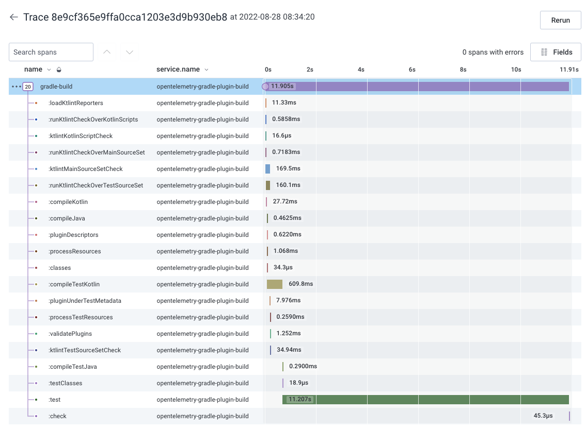
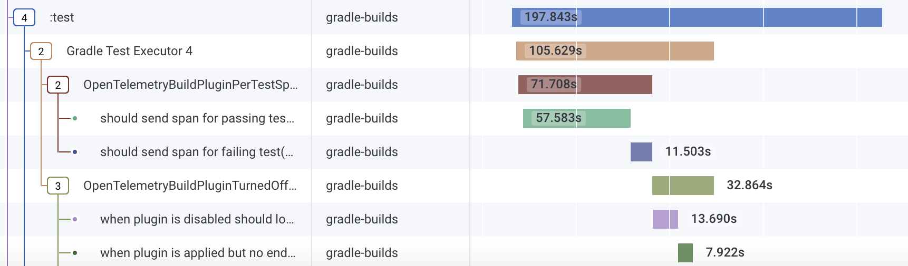
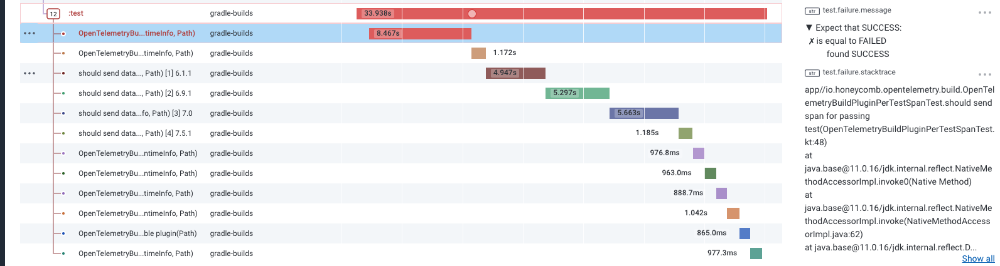
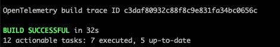

# Gradle OpenTelemetry build plugin

Find the slowest parts of your build with the Gradle OpenTelemetry build plugin. This plugin instruments your build
with OpenTelemetry traces and spans so you can visualize all tasks executed in your build, find where the build time is going, track build duration over time, etc.
You'll get a trace for each build with a span for every task, so you can find and optimize the bottlenecks in your build.



The plugin will also show you the test run breakdown per test case:



And the plugin also attaches information about test failures so you can view those as well:



The plugin will also log out the trace ID at the end of your build so you can easily find the exact trace for your build:



## OpenTelemetry spans and attributes

The plugin creates a single trace for each build, with an overall span for the build and child individual spans for each task.
The plugin also creates individual span for each test executed in a Gradle task with the `Test` type.

### Span attributes

The plugin adds the following attributes to the different spans it creates.

Root build span is named `${project.name}-build`, for example this plugin's root span is named `opentelemetry-gradle-plugin-build`
And the root span has the following attributes:

| Span attribute name | Description |
| ------------------- | ----------- |
| `build.task.names`  | Tasks included in the Gradle command that ran the build. For example, if you ran `./gradlew test build` this attribute would be "test build" |
| `build.success`     | Whether the build succeeded or failed (boolean) |

All spans (root span, task spans, etc.) have the following attributes:

| Span attribute name | Description |
| ------------------- | ----------- |
| `project.name`      | Name of the Gradle project |
| `gradle.version`    | Version of Gradle used to run the build |
| `system.is_ci`      | Whether the build was run in a CI environment or not (checks for existence of a `CI` environment variable) |

Each task has a child span created from the root build.
The task spans are named with the task path, for example `:test`
And each task span has the following attributes:

| Span attribute name | Description |
| ------------------- | ----------- |
| `task.name`         | Name of the task, e.g. `test` |
| `task.path`         | Full path to the task, including subproject names. E.g. `:app:test` |
| `task.type`         | Full package and class name of the task, e.g. `org.gradle.api.tasks.testing.Test`
| `task.outcome`      | Outcome of the task, e.g. `SUCCESS`, `UP-TO-DATE`, or `FROM-CACHE` |
| `task.did_work`     | Whether the task did work (boolean) |
| `error`             | If the task failed, the failure message |
| `task.failed`       | Set to `true` if the task failed |
| `task.failure`      | If the task failed, the failure message |

And finally the plugin creates a child span off each `Test` type task for each test executed.
The name of the per-test span is the full name of the test method.
And the attributes on the per-test spans are:

| Span attribute name       | Description |
| ------------------------- | ----------- |
| `test.result`             | Result of the test, e.g. `SUCCESS` or `FAILURE`
| `error`                   | If the test failed, the failure message |
| `test.failure.message`    | If the test failed, the failure message |
| `test.failure.stacktrace` | If the test failed, abbreviated stack trace of the failure |
| `task.name`               | Name of the task, e.g. `test` |

## Usage

### Add plugin

To start using the plugin, first add the plugin to the `plugins` block in your `build.gradle` file:

```
plugins {
    id 'com.atkinsondev.opentelemetry-build' version "1.4.0"
}
```

Please see the Gradle plugin portal for the latest version of the plugin: https://plugins.gradle.org/plugin/com.atkinsondev.opentelemetry-build

### Configure plugin

Then add a `openTelemetryBuild` block to your `build.gradle` file.

The only required configuration parameter is the server endpoint to send the OpenTelemetry data to.

```
openTelemetryBuild {
    endpoint = "https://<opentelemetry-server-domain>"
}
```

You can also add a map of headers to the data send to the OpenTelemetry server. Adding headers can be useful for passing things like an API key for authentication:

```
openTelemetryBuild {
    endpoint = "https://<opentelemetry-server-domain>"
    headers = ["X-API-Key": "<my-api-key>"]
}
```

### Zipkin Exporter configuration

In addition to the standard gRPC or HTTP OpenTelemetry exporters, the plugin supports exporting to Zipkin.

To export to Zipkin, set the `exporterMode` plugin configuration parameter to `OpenTelemetryExporterMode.ZIPKIN` and set the `endpoint` to be your Zipkin server API endpoint, similar to the following:

```
openTelemetryBuild {
    endpoint = "https://yourzipkinserver.com/api/v2/spans"
    serviceName = "appname-build"
    exporterMode = com.atkinsondev.opentelemetry.build.OpenTelemetryExporterMode.ZIPKIN
}
```

#### All configuration options

| Parameter        | Type                                                            | Default                          | Description                                   |
| ---------------- | --------------------------------------------------------------- | -------------------------------- | --------------------------------------------- |
| endpoint**       | `String`                                                        | `null`                           | OpenTelemetry server endpoint to send data to |
| headers          | `Map<String, String>`                                           | `null`                           | Headers to pass to the OpenTelemetry server, such as an API key |
| serviceName      | `String`                                                        | `gradle-builds`                  | Name of the service to identify the traces in your OpenTelemetry server, defaults to `gradle-builds` |
| exporterMode     | `OpenTelemetryExporterMode` | `OpenTelemetryExporterMode.GRPC` | OpenTelemetry exporter to use to send spans to your OpenTelemetry backend. Available options are `GRPC`, `HTTP`, or `ZIPKIN` |
| enabled          | `Boolean`                                                       | `true`                           | Whether the plugin is enabled or not |

** _Required_

## Compatibility

The plugin is compatible with Gradle versions `6.1.1` and higher.

### Limitations

* Incompatible with the configuration cache. This plugin uses a `BuildListener.buildFinished` event, which isn't compatible with the configuration cache
* Uses Gradle plugin capabilities that are slated to be deprecated in Gradle 8, such as `BuildListener` and `TaskListener`

## Changelog

* 1.4.0
  * Upgrading to OpenTelemetry 1.20.0 and Kotlin 1.7.21
* 1.3.1
  * Using baggage to put attributes `project.name`, `gradle.version`, and `system.is_ci` on all spans the plugin creates
* 1.3.0
  * Added support for Zipkin exporter. Upgrading to OpenTelemetry 1.19.0
* 1.2.1
  * Fix formatting of user-agent string
* 1.2.0
  * Disable the plugin gracefully if there is an error parsing the headers config
* 1.1.2
  * Adding task type to task span attribute `task.type`
* 1.1.1
  * Adding task names from Gradle execution as `build.task.names` attribute to root span
* 1.1.0
  * Upgrading to OpenTelemetry SDK 1.18.0
* 1.0.1
  * Adding `system.is_ci` attribute to root build span
* 1.0.0
  * Initial release
