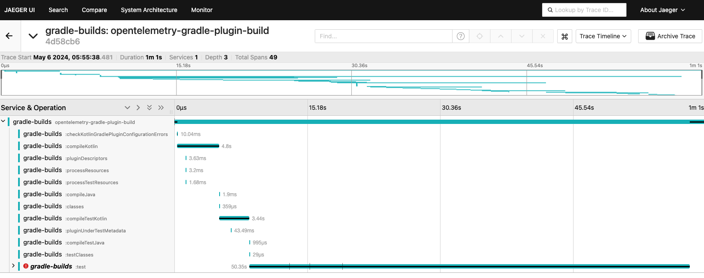

# Gradle OpenTelemetry build plugin

Find the slowest parts of your build with the Gradle OpenTelemetry build plugin. This plugin instruments your build
with OpenTelemetry traces and spans so you can visualize all tasks executed in your build, find where the build time is going, track build duration over time, etc.
You'll get a trace for each build with a span for every task, so you can find and optimize the bottlenecks in your build.


The plugin will also show you the test duration breakdown per test class and test case:


And the plugin also attaches information about test failures so you can view those as well:


The plugin will also log out the trace ID at the end of your build so you can easily find the exact trace for your build:


## OpenTelemetry spans and attributes

The plugin creates a single trace for each build, with an overall span for the build and child individual spans for each task.
The plugin also creates individual span for each test executed in a Gradle task with the `Test` type.

### Span attributes

The plugin adds the following attributes to the different spans it creates.

Root build span is named `${project.name}-build`, for example this plugin's root span is named `opentelemetry-gradle-plugin-build`
And the root span has the following attributes:

| Span attribute name | Description                                                                                                                                  |
|---------------------|----------------------------------------------------------------------------------------------------------------------------------------------|
| `build.task.names`  | Tasks included in the Gradle command that ran the build. For example, if you ran `./gradlew test build` this attribute would be "test build" |
| `build.success`     | Whether the build succeeded or failed (boolean)                                                                                              |

All spans (root span, task spans, etc.) have the following attributes:

| Span attribute name | Description                                                                                                |
|---------------------|------------------------------------------------------------------------------------------------------------|
| `project.name`      | Name of the Gradle project                                                                                 |
| `gradle.version`    | Version of Gradle used to run the build                                                                    |
| `system.is_ci`      | Whether the build was run in a CI environment or not (checks for existence of a `CI` environment variable) |

Each task has a child span created from the root build.
The task spans are named with the task path, for example `:test`
And each task span has the following attributes:

| Span attribute name | Description                                                                       |
|---------------------|-----------------------------------------------------------------------------------|
| `task.name`         | Name of the task, e.g. `test`                                                     |
| `task.path`         | Full path to the task, including subproject names. E.g. `:app:test`               |
| `task.type`         | Full package and class name of the task, e.g. `org.gradle.api.tasks.testing.Test` |
| `task.outcome`      | Outcome of the task, e.g. `SUCCESS`, `UP-TO-DATE`, or `FROM-CACHE`                |
| `task.did_work`     | Whether the task did work (boolean)                                               |
| `error`             | `true` if the task failed                                                         |
| `error_message`     | If the task failed, the failure message                                           |
| `task.failed`       | Set to `true` if the task failed                                                  |
| `task.failure`      | If the task failed, the failure message                                           |

And finally the plugin creates a child span off each `Test` type task for each test executed.
The name of the per-test span is the full name of the test method.
And the attributes on the per-test spans are:

| Span attribute name       | Description                                                |
|---------------------------|------------------------------------------------------------|
| `test.result`             | Result of the test, e.g. `SUCCESS` or `FAILURE`            |
| `error`                   | `true` if the test failed                                  |
| `error_message`           | If the test failed, the failure message                    |
| `test.failure.message`    | If the test failed, the failure message                    |
| `test.failure.stacktrace` | If the test failed, abbreviated stack trace of the failure |
| `task.name`               | Name of the task, e.g. `test`                              |

### Remote parent trace

Some CI execution systems such as Jenkins have support for creating a trace of the full CI execution,
where the Gradle build is just part of that whole execution.

Starting with plugin version `1.12.0`, the plugin will auto-detect these remote parent span and trace IDs
when they are passed in as environment variables and make the Gradle build part of that overall trace.

By default, the plugin uses parent environment variables named `SPAN_ID` and `TRACE_ID` - and those can be configured if
needed with plugin config parameters `parentSpanIdEnvVarName` and `parentTraceIdEnvVarName`.

### URL for viewing trace

Starting with plugin version `1.14.0`, you can specify the URL to view a trace in your OpenTelemetry backend
and the plugin will substitute the trace ID and print out a convenient URL to quickly view the trace in your telemetry UI.

For any OpenTelemetry backend, you can pass the `traceViewUrl` config parameter to specify the URL to view a trace with `{traceId}` in the place where the
plugin should substitute the trace ID for that build.

For example, for a local Jaeger instance with the UI running on port `16686`:

```groovy
openTelemetryBuild {
    endpoint = "http://localhost:4317"
    
    traceViewUrl = "http://localhost:16686/trace/{traceId}"
}
```

Then the plugin will print out the full URL to view the trace when the build completes:

```
OpenTelemetry build trace http://localhost:16686/trace/5a47e977c06a5d2a046d101fdedcb4ed
```

#### URLs for specific OpenTelemetry backends

As a convenience for known OpenTelemetry backends, you can specify the type of the backend with the `traceViewType` parameter
and then you only need to include the base URL for viewing traces:

```groovy
openTelemetryBuild {
    endpoint = "http://localhost:4317"
    
    traceViewType = com.atkinsondev.opentelemetry.build.TraceViewType.JAEGER
    traceViewUrl = "http://localhost:16686/"
}
```

## Usage

### Add plugin

To start using the plugin, first add the plugin to the `plugins` block in your `build.gradle` file:

```groovy
plugins {
    id 'com.atkinsondev.opentelemetry-build' version "4.4.0"
}
```

Please see the Gradle plugin portal for the latest version of the plugin: https://plugins.gradle.org/plugin/com.atkinsondev.opentelemetry-build

### Configure plugin

Then add a `openTelemetryBuild` block to your `build.gradle` file.

The only required configuration parameter is the server endpoint to send the OpenTelemetry data to.

```groovy
openTelemetryBuild {
    endpoint = "https://<opentelemetry-server-domain>"
}
```

You can also add a map of headers to the data send to the OpenTelemetry server. Adding headers can be useful for passing things like an API key for authentication:

```groovy
openTelemetryBuild {
    endpoint = "https://<opentelemetry-server-domain>"
    headers = ["X-API-Key": "<my-api-key>"]
}
```

### Zipkin Exporter configuration

In addition to the standard gRPC or HTTP OpenTelemetry exporters, the plugin supports exporting to Zipkin.

To export to Zipkin, set the `exporterMode` plugin configuration parameter to `OpenTelemetryExporterMode.ZIPKIN` and set the `endpoint` to be your Zipkin server API endpoint, similar to the following:

```groovy
openTelemetryBuild {
    endpoint = "https://yourzipkinserver.com/api/v2/spans"
    serviceName = "appname-build"
    exporterMode = com.atkinsondev.opentelemetry.build.OpenTelemetryExporterMode.ZIPKIN
}
```

### Pass trace and span IDs to `Exec` tasks as environment variables

Starting in plugin version `3.1.0` you can configure the plugin to pass the trace ID and span ID for the build
as environment variables to all `Exec` tasks in the build.
This can be helpful if you are executing commands that can support their own OpenTelemetry spans and you want
to integrate the spans from those commands with the main trace for your build.

Set the configuration parameter `taskTraceEnvironmentEnabled = true` to enable these environment variables:

```groovy
openTelemetryBuild {
    endpoint = "https://<opentelemetry-server-domain>"

    taskTraceEnvironmentEnabled = true
}
```

The environment variables are named `TRACE_ID`, `SPAN_ID`, and `TRACEPARENT` by default.

You can also customize those environment variable names with additional configuration parameters:

```groovy
openTelemetryBuild {
    endpoint = "https://<opentelemetry-server-domain>"

    taskTraceEnvironmentEnabled = true
    taskTraceEnvironmentTraceIdName = "MY_TRACE_ID"
    taskTraceEnvironmentSpanIdName = "MY_SPAN_ID"
  taskTraceEnvironmentTraceParentName = "MY_TRACEPARENT"
}
```

#### All configuration options

| Parameter                           | Type                        | Default                          | Description                                                                                                                                                                                                                                                                                                                                                                            |
|-------------------------------------|-----------------------------|----------------------------------|----------------------------------------------------------------------------------------------------------------------------------------------------------------------------------------------------------------------------------------------------------------------------------------------------------------------------------------------------------------------------------------|
| endpoint**                          | `String`                    | `null`                           | OpenTelemetry server endpoint to send data to                                                                                                                                                                                                                                                                                                                                          |
| headers                             | `Map<String, String>`       | `null`                           | Headers to pass to the OpenTelemetry server, such as an API key                                                                                                                                                                                                                                                                                                                        |
| serviceName                         | `String`                    | `gradle-builds`                  | Name of the service to identify the traces in your OpenTelemetry server, defaults to `gradle-builds`                                                                                                                                                                                                                                                                                   |
| exporterMode                        | `OpenTelemetryExporterMode` | `OpenTelemetryExporterMode.GRPC` | OpenTelemetry exporter to use to send spans to your OpenTelemetry backend. Available options are `GRPC`, `HTTP`, or `ZIPKIN`                                                                                                                                                                                                                                                           |
| enabled                             | `Boolean`                   | `true`                           | Whether the plugin is enabled or not                                                                                                                                                                                                                                                                                                                                                   |
| customTags                          | `Map<String, String>`       | `null`                           | Custom tags to add to each trace                                                                                                                                                                                                                                                                                                                                                       |
| parentSpanIdEnvVarName              | `String`                    | `SPAN_ID`                        | Environment variable name for a remote parent span ID (if using a parent trace like the Jenkins OpenTelemetry plugin)                                                                                                                                                                                                                                                                  |
| parentTraceIdEnvVarName             | `String`                    | `TRACE_ID`                       | Environment variable name for a remote parent trace ID (if using a parent trace like the Jenkins OpenTelemetry plugin)                                                                                                                                                                                                                                                                 |
| nestedTestSpans                     | `Boolean`                   | `true`                           | Whether test spans should be nested (per test executor, per test class, per method) or flat (just per test method)                                                                                                                                                                                                                                                                     |
| testSpans                           | `Boolean`                   | `true`                           | Whether test spans should be included in the trace at all                                                                                                                                                                                                                                                                                                                              |
| traceViewUrl                        | `String`                    | `null`                           | Pass in a URL to have the plugin print a link to the trace at the end of the build (in addition to printing the trace ID). Put `{traceId}` in the URL for the location where the trace ID should be substituted, e.g. `http://localhost:16686/trace/{traceId}`. If using `traceViewType`, only put the root URL of the server e.g. `http://localhost:16686` for a local Jaeger server. |
| traceViewType                       | `TraceViewType`             | `null`                           | Convenience for trace view URLs for known OpenTelemetry backends such as Jaeger. When set, you don't have to put the full trace URL in the `traceViewUrl` param, only the root path of the OpenTelemetry backend's URL.                                                                                                                                                                |
| supportConfigCache                  | `Boolean`                   | `false`                          | Enable experimental support for the Gradle configuration cache. When used with Gradle 8.5+, the plugin will auto-detect if the configuration cache is enabled and this parameter is not necessary                                                                                                                                                                                      |
| taskTraceEnvironmentEnabled         | `Boolean`                   | `false`                          | Whether to pass the trace and span IDs as environment variables to all `Exec` tasks in the build                                                                                                                                                                                                                                                                                       |
| taskTraceEnvironmentTraceIdName     | `String`                    | `TRACE_ID`                       | Name of trace ID environment variable passed to `Exec` tasks, when enabled                                                                                                                                                                                                                                                                                                             |
| taskTraceEnvironmentSpanIdName      | `String`                    | `SPAN_ID`                        | Name of span ID environment variable passed to `Exec` tasks, when enabled                                                                                                                                                                                                                                                                                                              |
| taskTraceEnvironmentTraceParentName | `String`                    | `TRACEPARENT`                    | Name of trace-parent environment variable passed to `Exec` tasks, when enabled                                                                                                                                                                                                                                                                                                         |

** _Required_

## Compatibility

The plugin is compatible with Java 21+ and Gradle versions `8.4` and higher.

### Limitations

#### Gradle configuration cache

There is experimental support for using this plugin with the [Gradle configuration cache](https://docs.gradle.org/current/userguide/configuration_cache.html).

To use the plugin with the configuration cache:

* With Gradle >=8.5 the plugin will auto-detect if the configuration cache is enabled
* With Gradle <8.5 set the plugin parameter `supportConfigCache = true`

Due to the fundamental plugin changes required to work with the configuration cache, not all span attributes are supported when the configuration cache is in use.

| Unsupported span attribute | Description                                                                       |
|----------------------------|-----------------------------------------------------------------------------------|
| `task.type`                | Full package and class name of the task, e.g. `org.gradle.api.tasks.testing.Test` |
| `task.did_work`            | Whether the task did work (boolean)                                               |

Similarly, there are span attributes that are only supported when the configuration cache is in use.

| Configuration cache only span attribute | Description                                                                                                                                                                                                                   |
|-----------------------------------------|-------------------------------------------------------------------------------------------------------------------------------------------------------------------------------------------------------------------------------|
| `task.execution_reasons`                | Comma separated list of reasons why the task was executed, if the task was not `SKIPPED`, `UP-TO-DATE`, or `FROM-CACHE`.                                                                                                      |
| `task.is_incremental`                   | Whether the task was executed [incrementally](https://docs.gradle.org/current/userguide/custom_tasks.html#sec:implementing_an_incremental_task), if the task was executed (ie. not `SKIPPED`, `UP-TO-DATE`, or `FROM-CACHE`). |

##### Trace and span ID environment variables

Passing trace and span ID environment variables to `Exec` tasks does not work when the configuration cache is enabled.

## Examples

### Jaeger

Example of running a Jaeger instance locally and publishing build traces to it:

Run Jaeger via Docker and enable the OpenTelemetry collector with `COLLECTOR_OTLP_ENABLED=true`:

```
docker run --name jaeger \
  -e COLLECTOR_OTLP_ENABLED=true \
  -p 16686:16686 \
  -p 4317:4317 \
  -p 4318:4318 \
  jaegertracing/all-in-one:1.64.0
```

The current version of the Jaeger Docker image is available at: https://hub.docker.com/r/jaegertracing/all-in-one/tags

Configure the plugin in `build.gradle` to point at the gRPC endpoint running on port `4317` in the local Jaeger instance:

```groovy
plugins {
  id 'com.atkinsondev.opentelemetry-build' version "4.4.0"
}

openTelemetryBuild {
    endpoint = "http://localhost:4317"
}
```

Then to view the build traces in your local Jaeger instance:

1. Go to the Jaeger UI that is running on http://localhost:16686
2. Select the service "gradle-builds"
3. Click "Find Traces"
4. Select one of the traces



## Changelog

* 4.4.0
  * Adding config option to disable test spans all together
* 4.3.0
  * Adding support task outcomes in configuration cache enabled builds
* 4.1.0
  * Upgrading to OpenTelemetry 1.49.0 and Gradle 8.14
* 4.0.0
  * **Breaking change**: plugin now requires Java 21+ and Gradle 8.4+
* 3.2.0
  * Upgrading to OpenTelemetry 1.48.0
  * Upgrading to Kotlin 2.0.21 and Gradle 8.13
* 3.1.1
  * Fixing root span start time when using configuration cache
* 3.1.0
  * Adding TRACEPARENT env variable for Exec tasks
  * Fixing Exec task parent span
* 3.0.1
  * Handle missing value exception when using configuration cache and no tests are run in the build
* 3.0.0
  * **Breaking change**: minimum supported version of Gradle is now Gradle 8.0
  * Added support passing trace ID and span ID as environment variables to `Exec` tasks
  * Upgraded to OpenTelemetry 1.45.0
* 2.2.0
  * Adding experimental support for using plugin with the [Gradle configuration cache](https://docs.gradle.org/current/userguide/configuration_cache.html)
* 2.1.0
  * Upgrading to OpenTelemetry 1.43.0
* 2.0.0
  * **Breaking change**: plugin now requires Java 17+ and Gradle 7.3+
  * Upgrading to Kotlin 1.9.24 and Gradle 8.10.2
* 1.14.0
  * Adding support for logging the URL to view the build's trace with `traceViewUrl`
* 1.13.0
  * Adding support for nested test spans in new parameter `nestedTestSpans` which defaults to `true`
* 1.12.0
  * Fix for publishing traces when parent trace information is present
* 1.10.0
  * Moving the error message string to the `error_message` attribute and making `error` be a boolean to render errors correctly in the Jaeger UI
  * Fixed problem where invalid parent span/trace ID error messages were logged when no parent or span IDs were set
  * Updating to OpenTelemetry 1.36.0, Gradle 8.7, and Kotlin 1.9.22
* 1.9.1
  * Fixing version in user-agent string
* 1.9.0
  * Upgrading to Gradle 8.5 and Kotlin 1.9.20 ([Gradle/Kotlin compatibility matrix](https://docs.gradle.org/current/userguide/compatibility.html#kotlin))
* 1.8.0
  * Upgrading to OpenTelemetry 1.33.0
* 1.7.1
  * Fix the support for remote parent span and trace IDs
* 1.7.0
  * Adding support for taking in remote parent span and trace IDs from systems like Jenkins for including this plugin's traces as part of an overall part trace
* 1.6.1
  * Downgrading Kotlin 1.7.10 to match the Kotlin version bundled with Gradle 7.6 ([Gradle compatibility matrix](https://docs.gradle.org/current/userguide/compatibility.html#kotlin))
* 1.6.0
  * Adding support for custom telemetry attributes (thanks @kpriemchenko !)
  * Upgrading to OpenTelemetry 1.29.0 and Kotlin 1.9.0
* 1.5.0
  * Upgrading to OpenTelemetry 1.22.0 and Kotlin 1.8.0
* 1.4.0
  * Upgrading to OpenTelemetry 1.20.0 and Kotlin 1.7.21
* 1.3.1
  * Using baggage to put attributes `project.name`, `gradle.version`, and `system.is_ci` on all spans the plugin creates
* 1.3.0
  * Added support for Zipkin exporter. Upgrading to OpenTelemetry 1.19.0
* 1.2.1
  * Fix formatting of user-agent string
* 1.2.0
  * Disable the plugin gracefully if there is an error parsing the headers config
* 1.1.2
  * Adding task type to task span attribute `task.type`
* 1.1.1
  * Adding task names from Gradle execution as `build.task.names` attribute to root span
* 1.1.0
  * Upgrading to OpenTelemetry SDK 1.18.0
* 1.0.1
  * Adding `system.is_ci` attribute to root build span
* 1.0.0
  * Initial release
