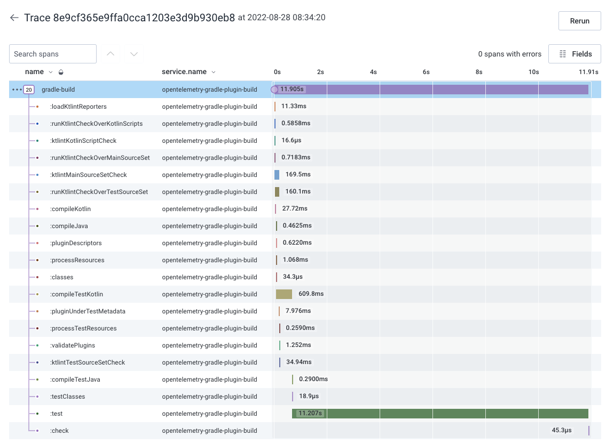
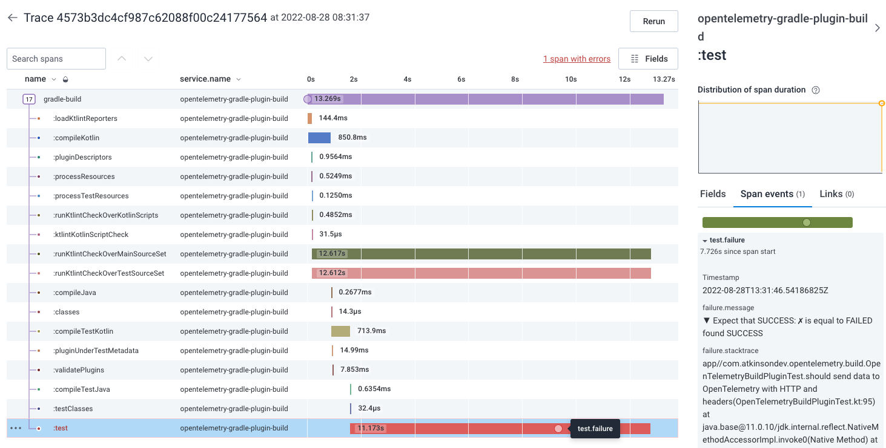

# Gradle OpenTelemetry build plugin

Find the slowest parts of your build with the Gradle OpenTelemetry build plugin. This plugin instruments your build
with OpenTelemetry traces and spans so you can visualize all tasks executed in your build, find where the build time is going, track build duration over time, etc.
You'll get a trace for each build with a span for every task, so you can find and optimize the bottlenecks in your build.



The plugin also attaches information about test failures so you can view those as well.



## Usage

### Add plugin

To start using the plugin, first add the plugin to the `plugins` block in your `build.gradle` file:

```
plugins {
    id '<domain>.opentelemetry-build' version "1.0.0"
}
```

Please see the Gradle plugin portal for the latest version of the plugin.

### Configure plugin

Then add a `openTelemetryBuild` block to your `build.gradle` file.

The only required configuration parameter is the server endpoint to send the OpenTelemetry data to. 

```
openTelemetryBuild {
    endpoint = "https://<opentelemetry-server-domain>"
}
```

You can also add a map of headers to the data send to the OpenTelemetry server. Adding headers can be useful for passing things like an API key for authentication:

```
openTelemetryBuild {
    endpoint = "https://<opentelemetry-server-domain>"
    headers = ["X-API-Key": "<my-api-key>"]
}
```

#### All configuration options

| Parameter                | Type                | Default                          | Description                                   |
| ---------------- | --------------------------- | -------------------------------- | --------------------------------------------- |
| endpoint**       | `String`                    | `null`                           | OpenTelemetry server endpoint to send data to |
| headers          | `Map<String, String>`       | `null`                           | Headers to pass to the OpenTelemetry server, such as an API key |
| exporterMode     | `OpenTelemetryExporterMode` | `OpenTelemetryExporterMode.GRPC` | Whether to send the data to the OpenTelemetry server via GRPC (default) or HTTP |

** _Required_
